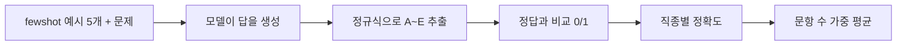

## 들어가며

ML/DL은 조금 공부해 봤지만 LLM은 거의 몰랐다. 이미지 분류 모델은 test set accuracy 하나만 보면 됐는데, LLM은 무엇으로 평가하는지 생각해 본 적이 없었다. 팀에서 맡은 벤치마크가 **KorMedMCQA**라서 데이터셋 페이지와 논문을 읽고 정리해 봤다.

정리하고 보니 결국 세 가지 질문이 남았다.

1. 이 벤치마크는 **무엇을** 재는가?
2. **어떻게** 채점하는가?
3. 읽으면서 **헷갈렸던 점**은 무엇인가?

## LLM 벤치마크 : 

LLM은 한 모델로 번역, 요약, 문제 풀이를 다 하고 출력도 자유로운 문장이다. 그래서 정해진 문제 세트와 정해진 채점 규칙을 두고, 모든 모델에게 같은 시험을 보게 한다. 이게 벤치마크다. ML의 test set과 비슷한데, 특정 모델용이 아니라 모두가 같이 치르는 **공통 시험지**라는 점이 다르다.

KorMedMCQA는 그중 **객관식(MCQA, Multiple-Choice QA)** 유형이다. 정답이 A~E 중 하나라서 채점이 비교적 간단할거라 생각했다.

## LLM 기초부터: 공부하며 헷갈렸던 것

벤치마크를 읽으려면 LLM이 어떻게 답을 내는지부터 알아야 했다. ML/DL 지식에서 출발해 정리하다가 헷갈렸던 것들을 적어 둔다.

### 1. 어텐션은 "내적으로 관련도를 재고, 그 비율대로 섞는" 연산이다

처음엔 Q, K, V가 단어 벡터에 곱하는 가중치이고, softmax로 가장 높은 하나를 고르는 줄 알았다. 반은 맞았다.

- 학습되는 가중치는 **W_Q, W_K, W_V**다. 토큰 임베딩 X에 이걸 곱해서 Q(찾는 것), K(이름표), V(넘겨줄 내용)를 만든다.
- Q와 K를 **내적**한 값이 곧 두 토큰의 관련도다.
- softmax는 1등을 뽑는 게 아니라 **섞을 비율**을 정한다.

| "먹었다"가 본 토큰 | softmax 후 |
|---|---|
| 나는 | 0.20 |
| 사과를 | **0.70** |
| 먹었다 | 0.10 |

"먹었다"의 새 벡터는 이 비율로 V를 더한 값이다. 그래서 "사과를 먹었다"라는 맥락이 벡터 안에 들어간다.

### 2. 어텐션, 조건부 확률, 최대우도는 다른 층위의 말이다

셋이 다 "다음 토큰 확률"과 엮여 있어서 같은 건 줄 알았다. 이미지 분류기와 나란히 놓으니 정리가 됐다.

| 층위 | LLM | CNN 분류기 |
|---|---|---|
| 모델 구조 | **어텐션** (Transformer) | Conv 층 |
| 모델 출력 | **조건부 확률** P(다음 토큰 \| 앞 토큰들) | P(클래스 \| 이미지) |
| 학습 목표 | **최대우도 추정** = cross-entropy 최소화 | cross-entropy 최소화 |

어텐션으로 계산해서 조건부 확률을 내고, 그 확률을 최대우도로 학습한다. 베이즈 정리는 나오지 않는다.

### 3. 가중치를 안 바꾸는데 5-shot이 왜 통할까

5-shot은 문제 앞에 "문제 → 정답" 예시 5개를 붙이는 방식이다. 가중치는 그대로라고 해서, 그럼 모델이 뭘 배우는 건지 이해가 안 됐다.

답은 **출력 = f(입력; θ)에서 θ는 고정이어도 입력이 바뀌면 출력이 바뀐다**는 것이었다. 예시 5개도 입력의 일부다. 진짜 문제의 `정답：` 자리가 어텐션으로 앞 예시의 `정답： B`를 참조해서 "알파벳 하나를 쓰면 되는구나"를 따라 한다. 지식을 가르치는 게 아니라 **답 형식을 맞추는** 장치다.

헷갈렸던 또 하나는 정답을 보여 주느냐였다. 예시 5개에는 정답이 붙어 있고, 진짜 문제는 정답 자리를 비운다. 모델에게 맞았는지 알려 주지 않고, 채점은 harness가 바깥에서 따로 한다.

### 4. logits는 "한 에포크의 결과"가 아니다

상용 모델은 logits를 못 본다는 말을 듣고, logits가 학습 한 바퀴(에포크)를 돈 결과인 줄 알았다. 실제로는 입력을 **한 번 forward했을 때** 마지막 층이 내는, 어휘 전체에 대한 점수다. 분류기의 클래스별 점수와 같다.

| | 오픈 웨이트 (Llama, Qwen, EEVE) | 상용 (GPT-4o, Claude) |
|---|---|---|
| 가중치 | 다운로드 가능 | 회사 서버에만 있음 |
| 받을 수 있는 것 | logits까지 | 대체로 완성된 글자만 |

logits가 있으면 A~E 각각의 확률(log-likelihood)을 비교해서 채점할 수 있다. 상용 모델은 그게 어렵다. KorMedMCQA가 모든 모델을 **글로 답하게 한 뒤 정규식으로 뽑는** 방식을 고른 이유가 여기 있었다.

### 인상 깊었던 점

**1. 평가에서는 temperature를 0으로 둔다.** 매번 확률이 가장 높은 토큰만 고르는 greedy가 되고, 같은 입력이면 항상 같은 답이 나온다(deterministic). temperature를 올리면 확률 분포가 평평해져서 답이 다양해진다. 의학 지식처럼 정답을 맞혀야 하는 문제에서는 다양한 답보다 **가장 확실한 답 하나**를 고르는 게 중요하다는 걸 새삼 느꼈다.

## KorMedMCQA는 무엇을 재나

한 줄로 요약하면 **"한국 보건의료인 국가시험을 LLM에게 풀게 한 것"**이다.

- 2012~2024년 의사, 간호사, 약사, 치과의사 국가시험 기출
- 총 7,469문항, 5지선다 (test는 3,009문항)
- KAIST 등이 국시원 공개 기출을 모아서 만들었고, 라이선스는 CC-BY-NC 2.0

### 왜 굳이 한국판이 필요할까

미국 의사시험(USMLE) 기반 MedQA가 이미 있다. 의학은 나라가 달라도 같으니 그걸로 충분하지 않을까 싶었는데, 실제 문항을 보니 생각이 바뀌었다.

> 의사 'A'가 군지역에 **의원**을 개설하려고 한다. 적절한 절차는?
> A. 개설신고서 → 군수 … D. 개설허가신청서 → 군수 …

이건 의학 문제가 아니다. "의원은 신고, 병원급은 허가"라는 **한국 의료법**을 알아야 풀린다. 논문의 오답 분석에서도 모델 오답의 **34%가 한국 법규 지식 부족** 때문이었다.

논문은 이걸 숫자로도 보여준다. 여러 모델의 점수 순위가 벤치마크끼리 얼마나 비슷한지 Spearman 상관을 구했다.

| | MedQA와의 상관 |
|---|---|
| MMLU-Pro (의료와 무관한 영어 시험) | **0.928** |
| KorMedMCQA (한국 의료 시험) | **0.763** |

같은 "의사 시험"인 KorMedMCQA보다 의료와 상관없는 MMLU-Pro가 MedQA와 더 비슷하게 움직인다. 시험 과목보다 **언어와 나라**가 점수를 더 크게 가른다는 뜻이다. 영어 의료 데이터로 추가 학습한 Meditron3-70B는 KorMedMCQA 점수가 오히려 떨어졌다(74.31 → 73.51).

그래서 내가 이해한 답은 이렇다. **KorMedMCQA는 "한국어로, 한국 제도 안에서" 의료 지식을 쓸 수 있는지를 잰다.**

## 어떻게 채점하나

전체 흐름은 다음과 같다.



### 1) 시험지: 연도로 자른 test

train은 ~2020년, dev는 2021년, **test는 2022~2024년**이다. 랜덤으로 섞지 않고 연도로 자른 이유는 오래된 기출일수록 인터넷에 퍼져서 모델 학습 데이터에 들어갔을 가능성이 크기 때문이다. 시계열 데이터에서 미래 구간을 test로 두는 것과 같은 발상이다. 여기서 시계열 데이터는 시간의 흐름에 따른 순서와 데이터 간의 인과관계가 중요하므로, 일반적인 머신러닝에서 사용하는 Random Split을 절대 사용해서는 안된다. 미래의 데이터가 과거 학습에 반영되면 데이터 Data Leakage가 발생하여 모델의 성능이 왜곡되기 때문이다. 

### 2) 문제 내는 방식: 5-shot

모델에게 문제만 주지 않고, 앞에 "문제 → 정답" 예시 5개를 붙인다.

```
[예시 문제] ... A. ... E. ...
정답： E
(× 5)

[실제 문제] ... A. ... E. ...
정답：
```

모델은 마지막 `정답：` 뒤를 이어서 쓴다. 가중치는 전혀 바뀌지 않고 프롬프트만 바뀐다. 이걸 in-context learning이라고 부른다. 예시는 항상 같은 5개(`first_n`)이고 temperature는 0이라서, 같은 모델이면 같은 결과가 나온다.

### 3) 답 뽑기: 정규식

객관식인데 왜 정규식이 필요할까? 모델이 "C"만 깔끔하게 출력하지 않고 "정답은 C 입니다"처럼 쓰기도 하기 때문이다. 그래서 아래 패턴을 순서대로 시도한다.

```python
r"정답[:\s]*([ABCDE])"        # "정답: C"
r"정답은\s*([ABCDE])\s*입니다"  # "정답은 C 입니다"
r"\b([ABCDE])\."              # "C."
r"\b([ABCDE])\b"              # 그냥 "C"
```

### 4) 점수: 문항 수로 가중한 평균

직종별 정확도를 구한 뒤 **test 문항 수로 가중 평균**한다. 간호사(878)와 약사(885)가 의사(435)보다 두 배쯤 크게 반영된다.

### 결과

| | 평균 |
|---|---|
| 실제 응시자 평균 | 77.05 |
| o1-preview | 92.72 |
| Claude-3.5-Sonnet | 86.51 |
| GPT-4o | 85.61 |
| Qwen2.5-72B (오픈소스 1위) | 78.86 |
| 무작위로 찍기 | 20 |

59개 모델 중 사람 평균을 넘은 건 6개였다. 난이도는 간호사 < 약사 < 의사 < 치과 순이었다.

## 문제 확인하기

데이터셋 페이지에서 의사 test 문항 중 법규 문제 몇 개를 골라 형식 등을 확인해봤다.

**Q1.** 2개월 남아가 BCG 접종 1개월 뒤 주사 부위 이상반응으로 접종한 의원을 찾아왔다. 「감염병예방법」에 따라 원장이 이상반응 발생신고서를 제출해야 할 대상은?
A. 대한의사협회장 B. 보건복지부장관 C. 남아 소재지 관할 보건소장 D. 관할 시장·군수·구청장 E. 관할 시·도지사

**Q2.** 전파 가능성을 고려하여 발생 또는 유행 시 24시간 이내에 신고해야 하고 격리가 필요한 감염병은?
A. 황열 B. 콜레라 C. B형간염 D. 일본뇌염 E. 인플루엔자

**Q3.** 50병상 병원을 200병상 종합병원으로 확장할 때 「의료법」상 추가로 설치해야 하는 진료과목은?
A. 치과 B. 정형외과 C. 영상의학과 D. 진단검사의학과 E. 정신건강의학과

<details markdown="1"><summary>정답 보기</summary>

Q1 **C**, Q2 **B**(콜레라, 제2급 감염병), Q3 **C**(영상의학과)

</details>

문제를 보고나니, 의학 지식이 아니라 "누구에게 신고하나"를 묻는 문제라 감으로 찍을 수밖에 없었다.
모델 오답의 34%가 법규 문제라는 게 이해가 됐다.

## 읽으면서 헷갈렸던 점

### 1. 객관식인데 왜 "생성"해서 채점하지?

처음엔 A~E 중 log-likelihood를 구할줄 알았다. 그런데 lm-evaluation-harness 설정을 보니 `generate_until`이었다. 모델이 글을 쓰게 하고 정규식으로 답을 뽑는다. 그래서 **답을 알아도 형식을 이상하게 쓰면 오답**이 된다. 결국 점수에는 의학 지식과 **출력 형식을 따르는 능력**이 섞여 있다.

### 2. 정규식이 생각보다 허술하다

- 마지막 패턴 `\b([ABCDE])\b`는 대소문자를 무시한다. 모델 출력에 영어 관사 "a"가 있으면 A로 잡힐 수 있고, 마지막 매치를 쓰기 때문에 엉뚱한 글자가 답이 될 수 있다.
- 프롬프트는 전각 콜론 `정답：`을 쓰는데, 첫 번째 패턴은 반각 `:`만 잡는다.

### 3. 같은 모델인데 점수가 다를 수 있다

harness는 **v3.0부터** 정규식 필터를 넣었다. 그 전 버전에서는 출력을 그대로 비교해서 `정답: B`라고 써도 틀린 것으로 처리됐다. 다른 곳에 올라온 점수와 비교할 때는 **도구 버전과 설정**부터 확인해야 한다.

### 4. "15% 높다"는 15%가 아니다

o1-preview(92.72)와 사람(77.05)의 차이는 15.67**%p**다. CoT로 "4.5% 올랐다"는 Claude도 86.51 → 90.96, 즉 4.45%p다. 사소해 보이지만 비율과 포인트를 구분하지 않으면 해석이 달라진다.

### 5. 사람 점수와 바로 비교해도 될까?

모델은 이미지 문제(약 1,000개)와 복수정답 문제를 뺀 시험을 봤고, 사람은 전체 시험을 봤다. "응시자 평균"은 합격선(보통 총점 60%)과도 다르다. "AI가 의사보다 낫다"는 식으로 읽으면 안 될 것 같다.

## 정리

KorMedMCQA를 읽기 전에는 "정확도 85%"를 그냥 숫자로 봤다. 지금은 그 숫자를 보면 같이 확인해야 할 게 떠오른다.

- **무엇을 쟀나**: 한국어, 한국 제도 안에서의 의료 지식 (이미지 문제 제외)
- **어떤 설정인가**: 5-shot, Direct인지 CoT인지, harness 버전
- **얼마나 믿을 수 있나**: 라벨 노이즈 약 6%, 오염 가능성, 90%대 포화

## 참고

- [KorMedMCQA 데이터셋 (HuggingFace)](https://huggingface.co/datasets/sean0042/KorMedMCQA)
- [논문: KorMedMCQA, arXiv 2403.01469](https://arxiv.org/abs/2403.01469)
- [lm-evaluation-harness `tasks/kormedmcqa`](https://github.com/EleutherAI/lm-evaluation-harness/tree/main/lm_eval/tasks/kormedmcqa)
