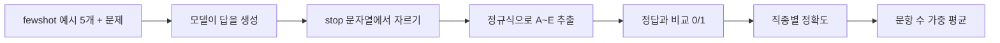

## 들어가며

ML/DL은 조금 공부해 봤지만 LLM은 거의 몰랐다. 이미지 분류 모델은 test set accuracy 하나만 보면 됐는데, LLM은 무엇으로 평가하는지 생각해 본 적이 없었다. 팀에서 맡은 벤치마크가 **KorMedMCQA**라서 데이터셋 페이지와 논문, 채점 코드를 차례로 읽어 봤다.

처음 "LLM 벤치마크"라는 말을 들었을 때는 모델 순위표 정도로만 생각했다. 그 숫자가 어떤 문제로, 어떤 규칙으로 매겨지는지는 궁금해 본 적이 없었다.

이번에 한국어 LLM 평가 벤치마크를 나눠 맡아 정리하고, 평가 도구 쪽 기여로 이어 가는 프로젝트에 참여하게 됐다. 기여를 하려면 먼저 내가 맡은 벤치마크가 어떻게 생겼는지부터 제대로 알아야 했다.

논문 요약만 읽고 끝내면 숫자를 외우는 것과 다를 게 없을 것 같았다. 그래서 이번에는 **데이터를 직접 내려받아 세어 보고, 채점 코드를 그대로 돌려 보는** 데까지 가 보기로 했다. 글은 이 질문 순서로 진행된다.

1. 이 벤치마크는 **무엇을** 재는가?
2. 데이터를 **직접 열어 보면** 무엇이 보이는가?
3. 모델 답은 **어떻게** 점수가 되는가?
4. 채점 코드는 **어디서 틀릴 수 있는가?**

## LLM 벤치마크란

LLM은 한 모델로 번역, 요약, 문제 풀이를 다 하고 출력도 자유로운 문장이다. 그래서 정해진 문제 세트와 정해진 채점 규칙을 두고, 모든 모델에게 같은 시험을 보게 한다. 이게 벤치마크다. ML의 test set과 비슷한데, 특정 모델용이 아니라 모두가 같이 치르는 **공통 시험지**라는 점이 다르다.

KorMedMCQA는 그중 **객관식(MCQA, Multiple-Choice QA)** 유형이다. 정답이 A~E 중 하나라서 채점이 간단할 거라 생각했다. 결론부터 말하면 그렇게 간단하지 않았다.

5-shot, logits, temperature처럼 본문에 나오는 LLM 기초 개념은 글 끝 **부록**에 따로 정리했다.

## KorMedMCQA는 무엇을 재나

한 줄로 요약하면 **"한국 보건의료인 국가시험을 LLM에게 풀게 한 것"**이다.


_HuggingFace 데이터셋 페이지. 태그에 Korean, medical, 라이선스 cc-by-nc-2.0이 보인다 (2026-10-09 캡처)_

- 2012~2024년 의사, 간호사, 약사, 치과의사 국가시험 기출
- 총 7,469문항, 5지선다 (test는 3,009문항)
- KAIST 등이 국시원 공개 기출을 모아서 만들었고, 라이선스는 **CC-BY-NC 2.0** (비상업적 용도만 가능)

### 왜 굳이 한국판이 필요할까

미국 의사시험(USMLE) 기반 MedQA가 이미 있다. 의학은 나라가 달라도 같으니 그걸로 충분하지 않을까 싶었는데, 실제 문항을 보니 생각이 바뀌었다.

> 의사 'A'가 군지역에 **의원**을 개설하려고 한다. 적절한 절차는?
> A. 개설신고서 → 군수 … D. 개설허가신청서 → 군수 …

이건 의학 문제가 아니다. "의원은 신고, 병원급은 허가"라는 **한국 의료법**을 알아야 풀린다. 논문의 오답 분석에서도 모델 오답의 **34%가 한국 법규 지식 부족** 때문이었다.

논문은 이걸 숫자로도 보여준다. 여러 모델의 점수 순위가 벤치마크끼리 얼마나 비슷한지 Spearman 상관을 구했다.


_논문 Table 3. 벤치마크 간 모델 점수 순위 상관 (arXiv 2403.01469v3 HTML판 캡처)_

| | MedQA와의 상관 (Spearman ρ) |
|---|---|
| MMLU-Pro (의료와 무관한 영어 시험) | **0.928** |
| KorMedMCQA (한국 의료 시험) | **0.763** |

같은 "의사 시험"인 KorMedMCQA보다 의료와 상관없는 MMLU-Pro가 MedQA와 더 비슷하게 움직인다. 시험 과목보다 **언어와 나라**가 점수를 더 크게 가른다는 뜻이다. 영어 의료 데이터로 추가 학습한 Meditron3-70B는 KorMedMCQA 점수가 오히려 떨어졌다(74.31 → 73.51).

그래서 내가 이해한 답은 이렇다. **KorMedMCQA는 "한국어로, 한국 제도 안에서" 의료 지식을 쓸 수 있는지를 잰다.**

## 데이터를 직접 열어 봤다

논문 표만 보고는 감이 안 와서 데이터를 직접 열었다. 확인은 두 군데서 했다.

- **HuggingFace Data Studio**: 브라우저에서 표를 보고, 오른쪽 SQL 콘솔(DuckDB)로 바로 집계한다.
- **로컬**: 4개 직종 × 4개 split, 16개 parquet 파일을 받아 pandas로 센다.

조회한 데이터셋 revision은 `79efd6f`(최종 수정 2024-12-09)다. 원본은 고치지 않고 읽기만 했다.

### 문항 하나부터 읽기


_Data Studio에서 doctor 설정의 test split(435행)을 연 화면 (HuggingFace에서 직접 캡처)_

doctor/test의 첫 행을 그대로 옮기면 이렇다.

```python
{'subject': 'doctor', 'year': 2022, 'period': 1, 'q_number': 1,
 'question': '2개월 남아가 BCG예방접종 1개월 뒤 주사 부위에 이상반응이 생겨서 ... 이상반응 발생신고서를 제출해야 할 대상은?',
 'A': '대한의사협회장', 'B': '보건복지부장관', 'C': '남아 소재지 관할 보건소장',
 'D': '남아 소재지 관할 시장 ∙ 군수 ∙ 구청장', 'E': '남아 소재지 관할 시 ∙ 도지사',
 'answer': 3, 'cot': ''}
```

컬럼마다 역할을 나눠 보면 다음과 같다.

| 컬럼 | 의미 | 눈여겨볼 점 |
|---|---|---|
| `subject` | 직종 | 아래에서 값이 하나 어긋난 걸 찾았다 |
| `year`, `period`, `q_number` | 시행 연도, 교시, 문항 번호 | 원본 시험지 위치를 그대로 보존 |
| `question`, `A`~`E` | 문제와 선택지 5개 | |
| `answer` | 정답 | **1~5 정수**. 0부터 세는 인덱스가 아니다 |
| `cot` | 풀이 과정 | fewshot split에만 있고 나머지는 빈 문자열 |

`answer`가 3이면 정답은 C다. 0부터 세는 Python 습관대로 읽으면 D로 착각한다. harness도 `['A','B','C','D','E'][answer-1]`로 변환한다.

### 숫자로 다시 세기

로컬에서는 이 정도 코드로 셌다.

```python
import pandas as pd

cfgs = ["doctor", "nurse", "pharm", "dentist"]
splits = ["train", "dev", "test", "fewshot"]
df = {(c, s): pd.read_parquet(f"data/{c}_{s}.parquet") for c in cfgs for s in splits}

pd.DataFrame({s: [len(df[(c, s)]) for c in cfgs] for s in splits}, index=cfgs)
```

| config | train | dev | test | fewshot | 연도 범위 |
|---|---|---|---|---|---|
| doctor | 1,890 | 164 | 435 | 5 | 2012–2024 |
| nurse | 582 | 291 | 878 | 5 | 2019–2024 |
| pharm | 632 | 300 | 885 | 5 | 2019–2024 |
| dentist | 297 | 304 | 811 | 5 | 2020–2024 |

fewshot 20개를 빼면 7,469개로 논문과 맞는다. 행 수를 맞추고 나니 논문에 없던 것들이 보이기 시작했다.

**1) split은 연도로 깔끔하게 잘려 있다.** 네 직종 모두 train은 ~2020, dev는 2021, test는 2022~2024년이다. 오래된 기출일수록 인터넷에 퍼져서 모델 학습 데이터에 들어갔을 가능성이 크기 때문이다. 시계열 데이터에서 미래 구간을 test로 두는 것과 같은 발상이다. 시계열 데이터는 시간 순서가 중요해서 일반적인 Random Split을 쓰면 안 된다. 미래 데이터가 학습에 섞이면 **Data Leakage**가 생겨 성능이 부풀려지기 때문이다.

**2) fewshot 5문항은 dev에서 왔다.** fewshot은 전부 2021년 문항이고, 질문 텍스트를 비교하면 5개 모두 dev에 그대로 있다. test와 겹치는 건 없다.


_doctor/fewshot split. 5행 모두 2021년 문항이다_

fewshot의 정답도 세어 봤다. 네 직종 모두 **A~E가 한 번씩** 들어 있다. doctor는 E, A, C, D, B 순서다. 예시 정답이 한 글자로 쏠려 있었다면 모델이 그 글자를 따라 쓸 수도 있었을 텐데, 그 걱정은 없다.

**3) 정답 위치는 거의 고르다.** 객관식이면 "모르면 특정 번호"가 통하는지 궁금했다. Data Studio SQL 콘솔에서 doctor/test부터 세 봤다.


_`SELECT answer, COUNT(*) FROM doctor_test GROUP BY answer` 결과_

test 3,009문항 전체로 보면 이렇다.

| 정답 | A | B | C | D | E |
|---|---|---|---|---|---|
| 비율 | 19.5% | 17.8% | 19.5% | **22.0%** | 21.1% |

**모든 문제에 D만 찍어도 22.0%**가 나온다. 무작위 기준선 20%보다 2%p 높다. 크지는 않지만, 약한 모델 점수를 읽을 때 "20% 근처면 찍은 수준"이라는 기준은 이 정도 여유를 두고 봐야 한다.

**4) 직종마다 문제 모양이 다르다.** test 문항의 질문 길이(글자 수) 중앙값을 비교했다.

| doctor | nurse | pharm | dentist |
|---|---|---|---|
| **235자** | 47자 | 80자 | 40자 |

의사 문제는 "55세 여자가 2일 전부터 열이 난다며…"로 시작하는 **긴 임상 증례**가 많다. 간호사와 치과 문제는 "렘(REM) 수면의 특징은?"처럼 짧은 지식 문제가 많다. 같은 "정확도"라도 직종마다 요구하는 능력이 꽤 다르다.

### 데이터에서 찾은 작은 어긋남 두 가지

**`subject` 값이 하나 다르다.** pharm 설정의 `subject` 값을 연도별로 세 봤다.


_pharm/test에서 2024년 271문항만 subject가 `pharmacy`다_

2022, 2023년은 `pharm`인데 **2024년 271문항만 `pharmacy`**다. 다른 split에는 `pharmacy`가 없다. harness는 `subject` 컬럼이 아니라 config 이름(`pharm`)으로 데이터를 불러오기 때문에 점수에는 영향이 없다. 다만 데이터를 합쳐 놓고 `subject == "pharm"`으로 거르면 271문항이 소리 없이 빠진다.

**같은 문제가 train과 test에 다시 나온다.** 직종별로 test 질문 문장이 train이나 dev에 똑같이 있는지 찾아봤다. 간호사에서 4건, 치과에서 1건이 걸렸다. 하나씩 열어 보니 대부분은 "렘(REM) 수면의 특징은?"처럼 **질문만 같고 선택지는 다른** 문제였다. 국시에 흔한 짧은 질문이라 겹친 것이다.

그런데 하나는 사실상 같은 문제였다.

| | train (2020년 3교시 25번) | test (2023년 3교시 25번) |
|---|---|---|
| 질문 | 간호사가 간호관리자에게 업무보고를 할 때 의사소통 방법으로 옳은 것은? | (동일) |
| B | 한 가지 경로로만 의사소통 한다. | 한 가지 경로로만 의사소통**을** 한다. |
| A, C, D, E | | (동일) |
| 정답 | 3 (C) | 3 (C) |

조사 하나만 다르다. 국가시험은 기출을 다시 내기도 하니, **연도로 잘라도 같은 문제가 test에 들어갈 수 있다**는 걸 보여 주는 사례다. 878문항 중 1문항이라 점수에 주는 영향은 작다. 그래도 "연도 분할 = 오염 없음"은 아니라는 걸 숫자로 확인했다.

## 어떻게 채점하나

전체 흐름은 다음과 같다.



채점 규칙은 lm-evaluation-harness의 `lm_eval/tasks/kormedmcqa`에 있다. 설정 파일 하나와 코드 하나만 보면 된다.

### 1) 모델이 실제로 받는 프롬프트

설정의 `doc_to_text`대로 doctor/test 첫 문항의 프롬프트를 직접 조립해 봤다. 앞에 fewshot 5개가 붙고 마지막이 `정답：`으로 끝난다.

```
13개월 남아가, 형이 하루 전 홍역으로 진단을 받아서 병원에 왔다. ... 조치는?BCG 1회...
A. 경과관찰
B. 비타민A
C. 단클론항체
D. 면역글로불린
E. 홍역- 볼거리- 풍진 백신
정답： E

... (예시 4개 더) ...

2개월 남아가 BCG예방접종 1개월 뒤 ... 이상반응 발생신고서를 제출해야 할 대상은?
A. 대한의사협회장
B. 보건복지부장관
C. 남아 소재지 관할 보건소장
D. 남아 소재지 관할 시장 ∙ 군수 ∙ 구청장
E. 남아 소재지 관할 시 ∙ 도지사
정답：
```

이 프롬프트 하나가 2,145자다. 모델은 마지막 `정답：` 뒤를 이어서 쓴다.

여기서 두 가지를 확인했다.

- **콜론이 전각(`：`)이다.** 키보드로 치는 반각 `:`가 아니다.
- **fewshot 예시에 풀이(cot)가 없다.** 데이터의 fewshot split에는 전문가가 쓴 풀이가 있지만, harness 프롬프트는 `정답： E`만 붙인다. 그래서 harness 기본 설정은 풀이 없이 바로 답하는 **Direct** 방식이다.

예시는 항상 같은 5개(`sampler: first_n`)이고 temperature는 0이라서, 같은 모델이면 같은 결과가 나온다.

### 2) 생성은 어디서 멈추나

`generation_kwargs.until`에 생성을 멈추는 문자열이 있다.

```yaml
until: ["Q:", "</s>", "<|im_end|>", ".", "\n\n"]
```

**마침표(`.`)가 들어 있다.** 모델이 "정답은 C 입니다."라고 쓰면 마침표 직전에서 잘린다. 풀이를 먼저 쓰는 CoT라면 "차근차근 생각해봅시다." 첫 문장에서 생성이 끝난다. 그래서 논문의 CoT 점수는 harness로는 재현되지 않는다. 논문의 CoT 결과는 API로 따로 잰 것이다.

### 3) 답 뽑기: 정규식

`utils.py`의 `ExtractChoiceFilter`가 잘린 출력에서 답 글자를 꺼낸다.


_`utils.py`. 논문 Appendix B의 추출 규칙을 옮긴 코드다_

```python
CHOICE_PATTERNS = [
    re.compile(r"정답[:\s]*([ABCDE])", re.IGNORECASE),      # "정답: C"
    re.compile(r"정답은\s*([ABCDE])\s*입니다", re.IGNORECASE), # "정답은 C 입니다"
    re.compile(r"\b([ABCDE])\.", re.IGNORECASE),             # "C."
    re.compile(r"\b([ABCDE])\b", re.IGNORECASE),             # 그냥 "C"
]
```

위 패턴부터 차례로 시도하고, **처음 걸린 패턴의 마지막 매치**를 답으로 쓴다. 아무것도 안 걸리면 빈 문자열이고, 오답 처리된다.

이 필터는 harness **task version 3.0**에서 들어왔다. 커밋 기록을 보면 2026년 6월(#3842)이다. 그 전에는 출력을 그대로 정답과 비교해서, `정답: B`라고 쓰면 맞아도 0점이었다. README 변경 기록에도 "단답이 아닌 모델은 점수가 오를 것"이라고 적혀 있다.

### 4) 점수: 문항 수로 가중한 평균

직종별 정확도(`exact_match`)를 구한 뒤 `weight_by_size: true`로 **test 문항 수만큼 가중 평균**한다. 간호사(878)와 약사(885)가 의사(435)보다 두 배쯤 크게 반영된다. 노트에서 GPT-4o 점수로 검산해 보니 가중 평균은 85.61로 논문 값과 같고, 단순 평균이면 85.53이었다.

## 채점 코드를 직접 돌려 봤다

코드를 읽다 보니 "이 정규식이 정말 다 잡을까?"가 궁금해졌다. 모델을 돌릴 환경은 없어서, **답처럼 생긴 문자열을 직접 만들어** 채점 과정만 재현했다. stop 문자열로 자르는 단계와 `extract_choice`를 harness 코드 그대로 옮겼다.

```python
STOPS = ["Q:", "</s>", "<|im_end|>", ".", "\n\n"]   # _template_yaml의 until

def truncate(s):
    cut = min([s.find(t) for t in STOPS if t in s], default=len(s))
    return s[:cut]

def extract_choice(output):                          # utils.py 그대로
    for p in CHOICE_PATTERNS:
        m = p.findall(output)
        if m:
            return m[-1].upper()
    return ""
```

정답이 C라고 두고 돌린 결과다. 아래 입력은 **모델이 실제로 낸 답이 아니라** 검사 동작을 보려고 내가 만든 문자열이다.

| 직접 만든 출력 | stop 적용 후 | 추출 | 걸린 패턴 | 판정 |
|---|---|---|---|---|
| `" C"` | `" C"` | C | 4 | 정답 |
| `"정답은 C 입니다."` | `"정답은 C 입니다"` | C | 2 | 정답 |
| `"정답：C"` | 그대로 | C | **4** | 정답 |
| `"C (남아 소재지 관할 보건소장)"` | 그대로 | C | 4 | 정답 |
| `"A가 아니라 C"` | 그대로 | C | 4 | 정답 |
| `"C번"` | 그대로 | **(빈칸)** | 없음 | **오답** |
| `"C가 정답이다"` | 그대로 | **(빈칸)** | 없음 | **오답** |
| `"A가 아니라 C이다"` | 그대로 | **(빈칸)** | 없음 | **오답** |
| `"정답은 3번입니다."` | `"정답은 3번입니다"` | **(빈칸)** | 없음 | **오답** |
| `"C is a correct answer"` | 그대로 | **A** | 4 | **오답** |

세 가지가 눈에 띄었다.

**1) 전각 콜론은 다행히 4번 패턴이 받아 준다.** 1번 패턴 `정답[:\s]*`은 반각 `:`만 잡으니 `정답：C`는 틀릴 거라 예상했다. 실제로 1번은 실패하지만, 마지막 `\b([ABCDE])\b`가 C를 잡는다. 결과는 같아도 **의도한 패턴이 아니라 마지막 안전망 덕분에** 맞는 셈이다.

**2) 한국어 조사가 붙으면 답을 못 찾는다.** 가장 의외였던 결과다. Python 정규식에서 한글은 영문자처럼 "단어 문자"로 취급된다. 그래서 `C가`, `C번`, `C이다`에서는 C와 조사 사이에 단어 경계(`\b`)가 생기지 않고, 4번 패턴이 C를 못 잡는다. **답을 알고 한국어로 자연스럽게 쓴 모델이 0점을 받는다.** 한국어 벤치마크라서 오히려 생기는 허점이다.

**3) 영어 관사 "a"가 답이 될 수 있다.** `IGNORECASE`라서 "a correct answer"의 `a`가 A로 잡히고, 마지막 매치를 쓰니 C 대신 A가 답이 된다. 다만 마침표에서 생성이 끊기기 때문에 긴 영어 문장이 나올 일은 많지 않다.

정리하면 지금 점수는 **의학 지식 + 프롬프트 형식대로 짧게 답하는 능력**이 섞인 값이다. fewshot이 `정답： E`처럼 한 글자로 답하는 모습을 다섯 번 보여 주니 대부분의 모델은 형식을 따를 것이다. 하지만 지시를 덜 따르는 작은 모델일수록 "알고도 틀리는" 비율이 커질 수 있다.

## 결과


_논문 Table 1. Avg는 test 문항 수로 가중한 평균이다 (arXiv 2403.01469v3 HTML판 캡처)_

| | 의사 | 간호사 | 약사 | 치과 | 평균 |
|---|---|---|---|---|---|
| 실제 응시자 평균 | 79.66 | 79.90 | 71.86 | 78.23 | 77.05 |
| o1-preview | 92.41 | 95.10 | 94.24 | 88.66 | **92.72** |
| Claude-3.5-Sonnet | 88.05 | 92.14 | 91.41 | 74.23 | 86.51 |
| GPT-4o | 85.98 | 91.46 | 85.99 | 78.67 | 85.61 |
| Qwen2.5-72B (오픈소스 1위) | 77.24 | 87.47 | 82.71 | 66.21 | 78.86 |
| 무작위로 찍기 | 20 | 20 | 20 | 20 | 20 |

59개 모델 중 사람 평균을 넘은 건 6개였다. 난이도는 간호사 < 약사 < 의사 < 치과 순이었다. 저자들은 학습 데이터에 치과 자료가 적기 때문이라고 추정한다.

CoT를 쓰면 점수가 오른다.


_논문 Table 2. 상위 3개 모델의 Direct와 CoT 비교_

Claude-3.5-Sonnet은 86.51에서 90.96으로 4.45%p 올랐다. 다만 Gemini-1.5-pro는 치과에서 CoT를 쓰자 오히려 떨어졌다(70.28 → 67.82). 앞에서 봤듯 이 CoT 점수는 harness 기본 설정으로는 나오지 않는다.

## 문제 직접 풀어 보기

데이터를 보다가 의사 test의 법규 문제 몇 개를 골라 직접 풀어 봤다.

**Q1.** 2개월 남아가 BCG 접종 1개월 뒤 주사 부위 이상반응으로 접종한 의원을 찾아왔다. 「감염병예방법」에 따라 원장이 이상반응 발생신고서를 제출해야 할 대상은?
A. 대한의사협회장 B. 보건복지부장관 C. 남아 소재지 관할 보건소장 D. 관할 시장·군수·구청장 E. 관할 시·도지사

**Q2.** 전파 가능성을 고려하여 발생 또는 유행 시 24시간 이내에 신고해야 하고 격리가 필요한 감염병은?
A. 황열 B. 콜레라 C. B형간염 D. 일본뇌염 E. 인플루엔자

**Q3.** 50병상 병원을 200병상 종합병원으로 확장할 때 「의료법」상 추가로 설치해야 하는 진료과목은?
A. 치과 B. 정형외과 C. 영상의학과 D. 진단검사의학과 E. 정신건강의학과

<details markdown="1"><summary>정답 보기</summary>

Q1 **C**, Q2 **B**(콜레라, 제2급 감염병), Q3 **C**(영상의학과)

</details>

의학 지식이 아니라 "누구에게 신고하나"를 묻는 문제라 감으로 찍을 수밖에 없었다. 모델 오답의 34%가 법규 문제라는 게 이해가 됐다.

세 문제 모두 확신을 갖고 고른 답은 없었다. 사람에게는 "외워야 아는" 문제가 모델에게도 똑같이 어렵다는 점이 흥미로웠다.

## 숫자를 읽을 때 조심할 점

### 1. 객관식인데 "생성"해서 채점한다

처음엔 A~E 중 log-likelihood를 구할 줄 알았다. 그런데 설정은 `generate_until`이었다. 모델이 글을 쓰게 하고 정규식으로 답을 뽑는다. 그래서 **답을 알아도 형식을 이상하게 쓰면 오답**이 된다. 위 실험의 `C가 정답이다`가 그 예다.

### 2. 같은 모델인데 점수가 다를 수 있다

답 추출 필터는 task version 3.0부터 들어갔다. 그 전 버전으로 잰 점수와 지금 점수는 직접 비교하면 안 된다. 다른 곳에 올라온 점수를 볼 때는 **harness 버전과 task version**부터 확인해야 한다.

### 3. "15% 높다"는 15%가 아니다

o1-preview(92.72)와 사람(77.05)의 차이는 15.67**%p**다. CoT로 "4.5% 올랐다"는 Claude도 86.51 → 90.96, 즉 4.45%p다. 사소해 보이지만 비율과 포인트를 구분하지 않으면 해석이 달라진다.

### 4. 사람 점수와 바로 비교해도 될까?

모델은 이미지 문제(약 1,000개)와 복수정답 문제(약 100개)를 뺀 시험을 봤고, 사람은 전체 시험을 봤다. "응시자 평균"은 합격선(보통 총점 60%)과도 다르다. "AI가 의사보다 낫다"는 식으로 읽으면 안 될 것 같다.

### 5. 바닥과 천장이 생각보다 좁다

바닥은 무작위 20%가 아니라 "D만 찍기" 22.0%다. 천장 쪽에서는 논문 오답 분석에서 문제 오류 4%, 라벨 오류 2%가 확인됐다. o1-preview가 이미 92.72라서, 90%대에서 1~2%p 차이로 모델 우열을 가리기는 어렵다.

## 다음에 해 볼 것

이번에는 데이터와 채점 코드를 읽고, 직접 만든 문자열로 검사 동작만 확인했다. 실제 모델 점수는 아직 재지 않았다. 다음 순서로 넘어가려 한다.

1. 작은 오픈 모델 하나로 `lm_eval --tasks kormedmcqa`를 돌려서, 실제 출력 중 **추출이 빈칸으로 끝난 비율**을 센다.
2. 빈칸이 나온 출력을 모아서 `C가`, `C번` 같은 조사 붙은 형태가 실제로 나오는지 본다.
3. 실제로 나온다면 4번 패턴을 한국어에 맞게 고치는 방안을 정리하고, 이슈로 올릴 만한지 판단한다. `subject` 값 어긋남도 데이터셋 쪽에 알릴 만한지 같이 본다.

```bash
pip install lm-eval
lm_eval --model hf --model_args pretrained=<모델이름> --tasks kormedmcqa --num_fewshot 5 --log_samples
```

처음에는 논문을 요약하는 것만으로 충분하다고 생각했다. 그런데 데이터를 직접 세고 채점 코드를 돌려 보니, 논문에 없는 작은 어긋남이 여러 개 보였다. 이런 것들을 근거와 함께 하나씩 적어 두는 게 기여의 첫걸음일 것 같다.

## 정리

KorMedMCQA를 읽기 전에는 "정확도 85%"를 그냥 숫자로 봤다. 지금은 그 숫자를 보면 같이 확인해야 할 게 떠오른다.

| 질문 | 확인할 것 |
|---|---|
| **무엇을 쟀나** | 한국어, 한국 제도 안에서의 의료 지식. 이미지 문제는 빠졌다 |
| **어떤 설정인가** | 5-shot, Direct인지 CoT인지, harness task version |
| **채점이 공정한가** | 정규식이 한국어 조사 붙은 답을 놓친다. 점수에 형식 준수 능력이 섞인다 |
| **얼마나 믿을 수 있나** | 라벨 노이즈 약 6%, 기출 재출제로 인한 중복, 90%대 포화 |

> 이 글의 데이터 통계와 정규식 실험은 데이터셋 revision `79efd6f`, lm-evaluation-harness 커밋 `97a5e2c` 기준이다. 정규식 실험의 입력은 직접 만든 문자열이고 실제 모델 출력이 아니다.

## 부록: LLM 기초, 공부하며 헷갈렸던 것

벤치마크를 읽다 보니 LLM이 어떻게 답을 내는지부터 알아야 했다. 본문에 나온 5-shot, logits, temperature 같은 말을 ML/DL 지식에서 출발해 정리하다가 헷갈렸던 것 네 가지를 따로 적어 둔다.

### 1. 어텐션은 "내적으로 관련도를 재고, 그 비율대로 섞는" 연산이다

처음엔 Q, K, V가 단어 벡터에 곱하는 가중치이고, softmax로 가장 높은 하나를 고르는 줄 알았다. 반은 맞았다.

- 학습되는 가중치는 **W_Q, W_K, W_V**다. 토큰 임베딩 X에 이걸 곱해서 Q(찾는 것), K(이름표), V(넘겨줄 내용)를 만든다.
- Q와 K를 **내적**한 값이 곧 두 토큰의 관련도다.
- softmax는 1등을 뽑는 게 아니라 **섞을 비율**을 정한다.

| "먹었다"가 본 토큰 | softmax 후 |
|---|---|
| 나는 | 0.20 |
| 사과를 | **0.70** |
| 먹었다 | 0.10 |

"먹었다"의 새 벡터는 이 비율로 V를 더한 값이다. 그래서 "사과를 먹었다"라는 맥락이 벡터 안에 들어간다.

### 2. 어텐션, 조건부 확률, 최대우도는 다른 층위의 말이다

셋이 다 "다음 토큰 확률"과 엮여 있어서 같은 건 줄 알았다. 이미지 분류기와 나란히 놓으니 정리가 됐다.

| 층위 | LLM | CNN 분류기 |
|---|---|---|
| 모델 구조 | **어텐션** (Transformer) | Conv 층 |
| 모델 출력 | **조건부 확률** P(다음 토큰 \| 앞 토큰들) | P(클래스 \| 이미지) |
| 학습 목표 | **최대우도 추정** = cross-entropy 최소화 | cross-entropy 최소화 |

어텐션으로 계산해서 조건부 확률을 내고, 그 확률을 최대우도로 학습한다. 베이즈 정리는 나오지 않는다.

### 3. 가중치를 안 바꾸는데 5-shot이 왜 통할까

5-shot은 문제 앞에 "문제 → 정답" 예시 5개를 붙이는 방식이다. 가중치는 그대로라고 해서, 그럼 모델이 뭘 배우는 건지 이해가 안 됐다.

답은 **출력 = f(입력; θ)에서 θ는 고정이어도 입력이 바뀌면 출력이 바뀐다**는 것이었다. 예시 5개도 입력의 일부다. 진짜 문제의 `정답：` 자리가 어텐션으로 앞 예시의 `정답： B`를 참조해서 "알파벳 하나를 쓰면 되는구나"를 따라 한다. 지식을 가르치는 게 아니라 **답 형식을 맞추는** 장치다.

헷갈렸던 또 하나는 정답을 보여 주느냐였다. 예시 5개에는 정답이 붙어 있고, 진짜 문제는 정답 자리를 비운다. 모델에게 맞았는지 알려 주지 않고, 채점은 harness가 바깥에서 따로 한다.

### 4. logits는 "한 에포크의 결과"가 아니다

상용 모델은 logits를 못 본다는 말을 듣고, logits가 학습 한 바퀴(에포크)를 돈 결과인 줄 알았다. 실제로는 입력을 **한 번 forward했을 때** 마지막 층이 내는, 어휘 전체에 대한 점수다. 분류기의 클래스별 점수와 같다.

| | 오픈 웨이트 (Llama, Qwen, EEVE) | 상용 (GPT-4o, Claude) |
|---|---|---|
| 가중치 | 다운로드 가능 | 회사 서버에만 있음 |
| 받을 수 있는 것 | logits까지 | 대체로 완성된 글자만 |

logits가 있으면 A~E 각각의 확률(log-likelihood)을 비교해서 채점할 수 있다. 상용 모델은 그게 어렵다. KorMedMCQA가 모든 모델을 **글로 답하게 한 뒤 정규식으로 뽑는** 방식을 고른 이유가 여기 있었다.

### 인상 깊었던 점

**1. 평가에서는 temperature를 0으로 둔다.** 매번 확률이 가장 높은 토큰만 고르는 greedy가 되고, 같은 입력이면 항상 같은 답이 나온다(deterministic). temperature를 올리면 확률 분포가 평평해져서 답이 다양해진다. 의학 지식처럼 정답을 맞혀야 하는 문제에서는 다양한 답보다 **가장 확실한 답 하나**를 고르는 게 중요하다는 걸 새삼 느꼈다.

**2. 객관식인데도 "답을 어떻게 쓰느냐"가 점수에 들어간다.** 모델이 정답을 알고 있어도 형식이 다르면 틀린 것으로 처리된다. 평가는 모델만 보는 게 아니라 채점 규칙까지 같이 봐야 한다는 걸 알게 됐다.

## 참고

- [KorMedMCQA 데이터셋 (HuggingFace)](https://huggingface.co/datasets/sean0042/KorMedMCQA)
- [논문: KorMedMCQA, arXiv 2403.01469v3](https://arxiv.org/abs/2403.01469v3)
- [lm-evaluation-harness `tasks/kormedmcqa`](https://github.com/EleutherAI/lm-evaluation-harness/tree/main/lm_eval/tasks/kormedmcqa)
- [lm-evaluation-harness PR #3842: 답 추출 필터 추가](https://github.com/EleutherAI/lm-evaluation-harness/pull/3842)
- [오픈소스 기여를 준비하며: IFEval-Ko 알아보기](https://velog.io/@subjeelee/오픈소스-기여를-준비하며-IFEval-Ko-알아보기) (같은 프로젝트에서 다른 벤치마크를 다룬 글. 구성을 참고했다)
